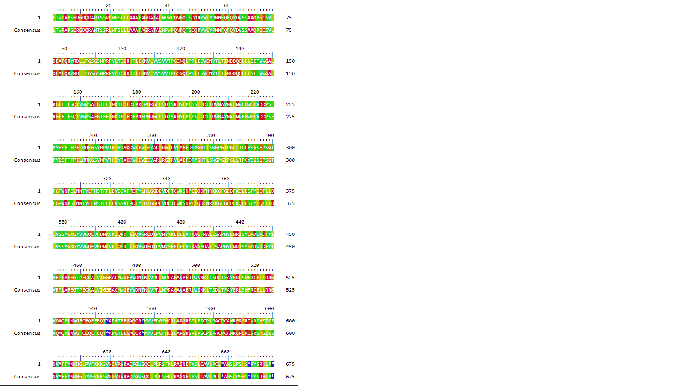
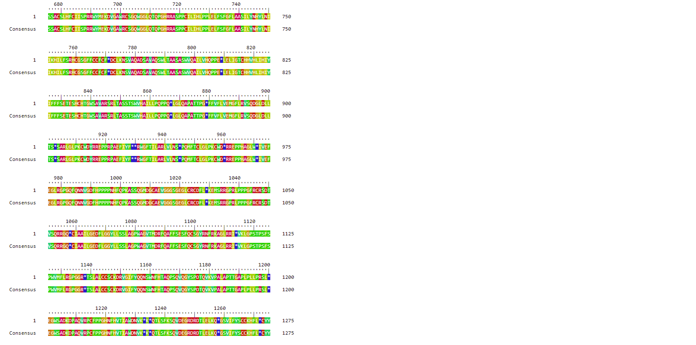
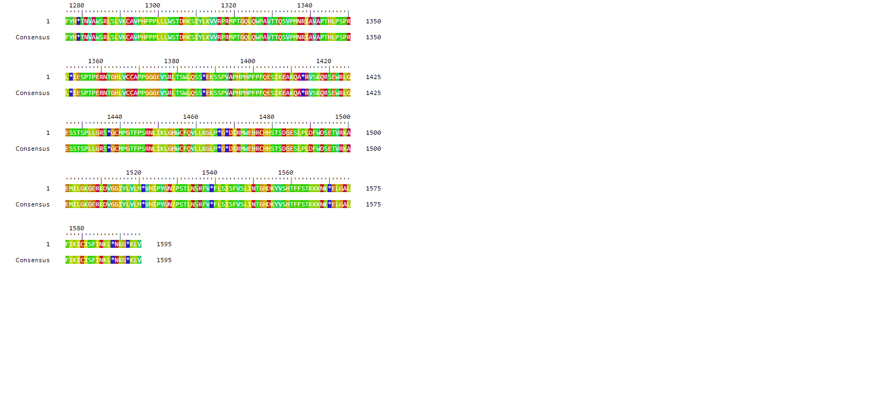
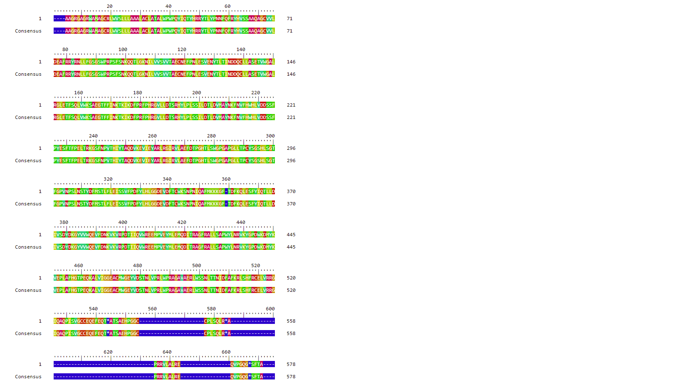
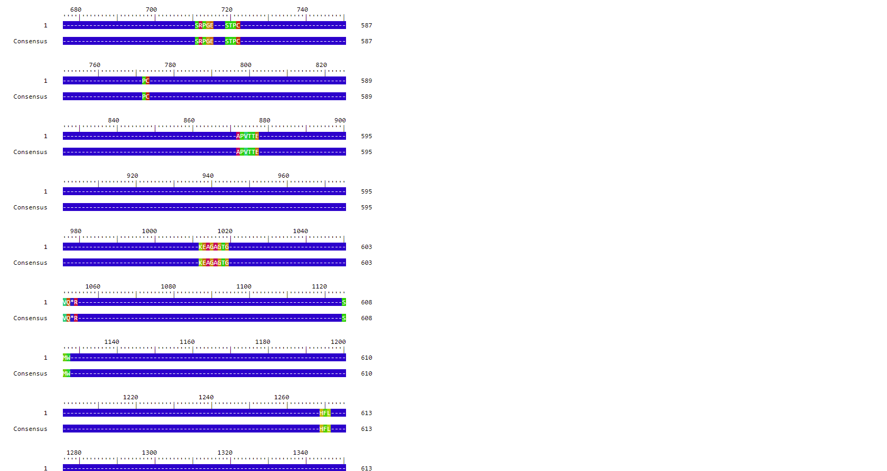
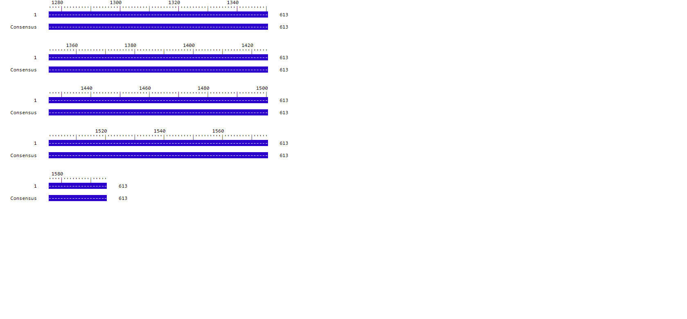

```{r setup, include=FALSE}
knitr::opts_chunk$set(echo = TRUE)
library(ape)
library(Biostrings)
library(DECIPHER)
library(ORFik)
```

## R Markdown

This is an R Markdown document. Markdown is a simple formatting syntax for authoring HTML, PDF, and MS Word documents. For more details on using R Markdown see <http://rmarkdown.rstudio.com>.

When you click the **Knit** button a document will be generated that includes both content as well as the output of any embedded R code chunks within the document. You can embed an R code chunk like this:


##Question 1
#Subtask (a)

```{r}

seqMouse <- read.GenBank("AK080777", as.character = TRUE)[[1]]
seqMouseStr <- paste(seqMouse, sep ="", collapse = "")
DNAMouseStr <- DNAString(seqMouseStr)

seqHuman <- read.GenBank("NM_000520", as.character = TRUE)[[1]]
seqHumanStr <- paste(seqHuman, sep ="", collapse = "")
DNAHumanStr <- DNAString(seqHumanStr)

DNAMouseStr

DNAHumanStr

```
#Subtask (b)

```{r}

findORFs(toupper(DNAMouseStr))
findORFs(toupper(DNAHumanStr))
```

#Subtask (c)

```{r}
seqMouseProtein <-  translate(DNAMouseStr)
seqHumanProtein <- translate(DNAHumanStr)

seqMouseProtein
seqHumanProtein
```

#Subtask (d)

```{r}

a <- pairwiseAlignment(seqHumanProtein, 
                       seqMouseProtein, 
                       type = "global", 
                       substitutionMatrix = "BLOSUM62")

score(a)

alignedPattern(a)

alignedSubject(a)

b <-
BrowseSeqs(alignedPattern(a), colWidth = 75)





BrowseSeqs(alignedSubject(a), colWidth = 75)





```

#Subtask (e)
```{r}

matchPattern("*", seqMouseProtein) 
matchPattern("*", seqHumanProtein)


```

#Subtask (f)

```{r}

newSeqHumanProtein <- subseq(seqHumanProtein, start = 1, end = 543)
newSeqMouseProtein <- subseq(seqMouseProtein, start = 1, end = 538)

newSeqHumanProtein
newSeqMouseProtein


```

#Subtask (g)

```{r}

d <- pairwiseAlignment(newSeqHumanProtein,
                       newSeqMouseProtein, 
                       type = "global", 
                       substitutionMatrix = "BLOSUM62")

score(d)

#The score is marginally better for the 
#shortened sequence than the original sequence
```

#Subtask (h)

```{r}

e <- pairwiseAlignment(seqHumanProtein, 
                       seqMouseProtein, 
                       type = "local", 
                       substitutionMatrix = "BLOSUM62")

score(e)
#The score using the Smith-Waterman local alignment is marginally better 
#than the global alignment because the global alignment yielded 
#a negative score, which means that there are many badly aligning regions, 
#or many gaps in the alignment. The local alignment ignores those.
```

##Question 2
#Subtask (a)

```{r}

string1 <- AAString(x = "HEAGAWGHEE")
string2 <- AAString(x = "PAWHEAE")

f <- pairwiseAlignment(string1, 
                       string2, 
                       type = "global", 
                       substitutionMatrix = "BLOSUM50", 
                       gapOpening = 1, 
                       gapExtension = 2)
score(f)
```

#Subtask (b)

```{r}

randomSequences <- function(seq, n){
# Generates "n" random amino acid sequences for a given sequence
#
# Inputs:
# seq - the sequence from which to sample
# n - number of generated random sequences
#
# Output: a cell array of n random sequences
# Identifies the unique amino acids
  s <- uniqueLetters(seq)
# Calculates the length of given amino acid sequence
  l <- length(seq)
# Calculates the proportions of amino acids of the given sequence
  t <- letterFrequency(seq, letters = s)/l
# Generates n random amino acid sequences
  randseqs <- c(1:n)
    for (i in 1:n){
  randseqs[i] <- paste(sample(s, length(seq), replace = T, prob = t), collapse="")
}
# Returns generated random sequences
return(randseqs)
}

string3 <- randomSequences(string2, 1000)


```

#Subtask (c)

```{r}
score = vector()

for (i in 1:length(string3)) {
  score[i] <- score(pairwiseAlignment(string1, string3[i], type = "global", 
                                      substitutionMatrix = "BLOSUM50",  
                                      gapOpening = 1, 
                                      gapExtension = 2))
}
score

```
#Subtask (d)

```{r}
hist(score)


pvalue <- length(which(score >= 27)) / length(score)

pvalue
#The alignment is almost statiscally significant
#since the p-value is larger than 0.05, which means that 
#6.9% of random sequences would have as large score as our result.

```